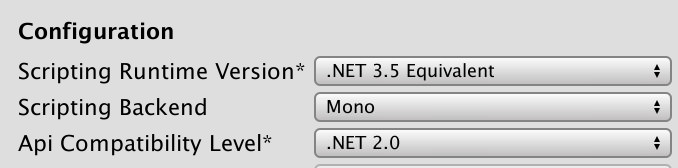
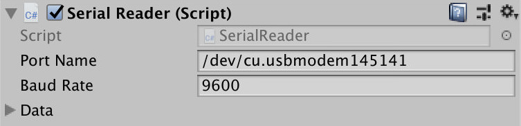
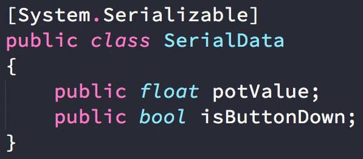
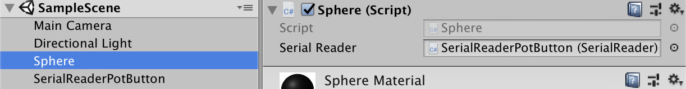

# Unity Arduino

Demo project showing how to control parameters in Unity with an Arduino.

## Settings

To read Serial data you *must* change the following setting in a new Unity project:

`Edit > Project Settings > Player > Api Compatibility Level`

Set this to `.NET 2.0`, (not `.NET 2.0 Subset`)

## Serial port

The `Serial` script should be attached to an empty GameObject. The port and baud rate can then be set in the editor.

## Serial Data

The data to be received can be changed in the `SerialReader` script. The names must *exactly* match those being sent by the Arduino.

If using multiple serial devices, this class should/could be templated.

## Using Serial Data

To control an object via serial, give it a script with a public `SerialReader` property and drag your `SerialReader` object onto it in the editor.

You can then read the values from the data, e.g. `serialReader.data.isButtonDown`

See the `Sphere.cs` script for an example.

